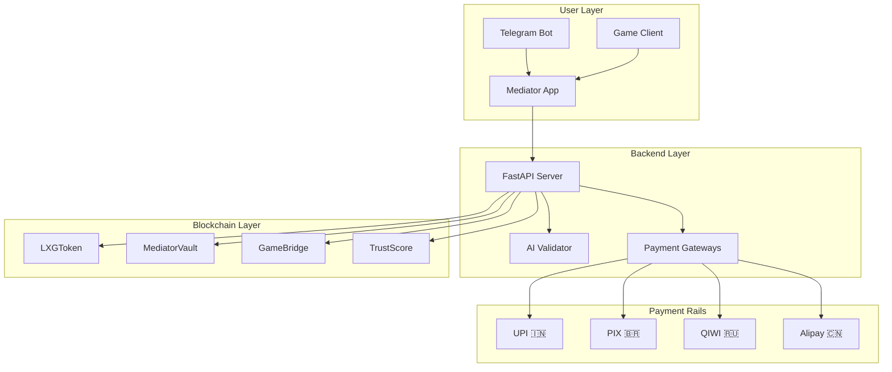
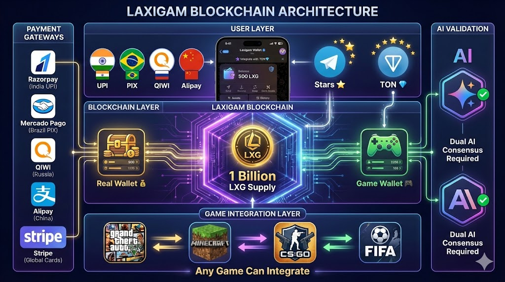
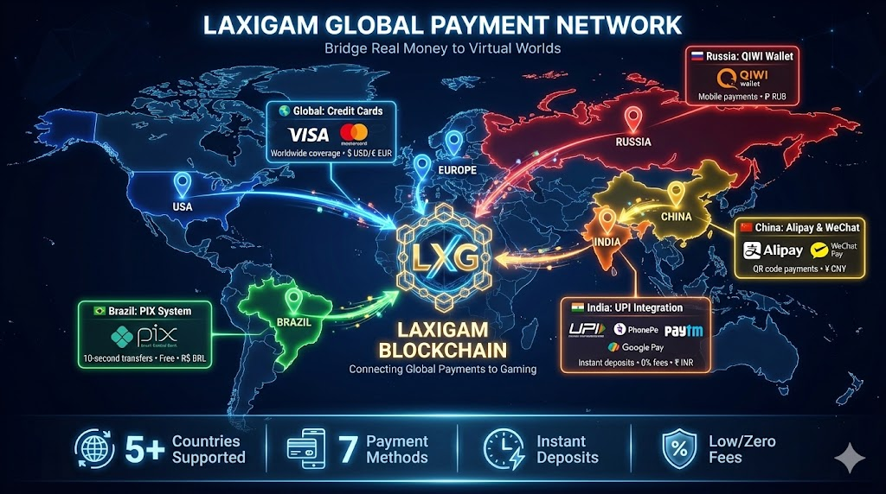
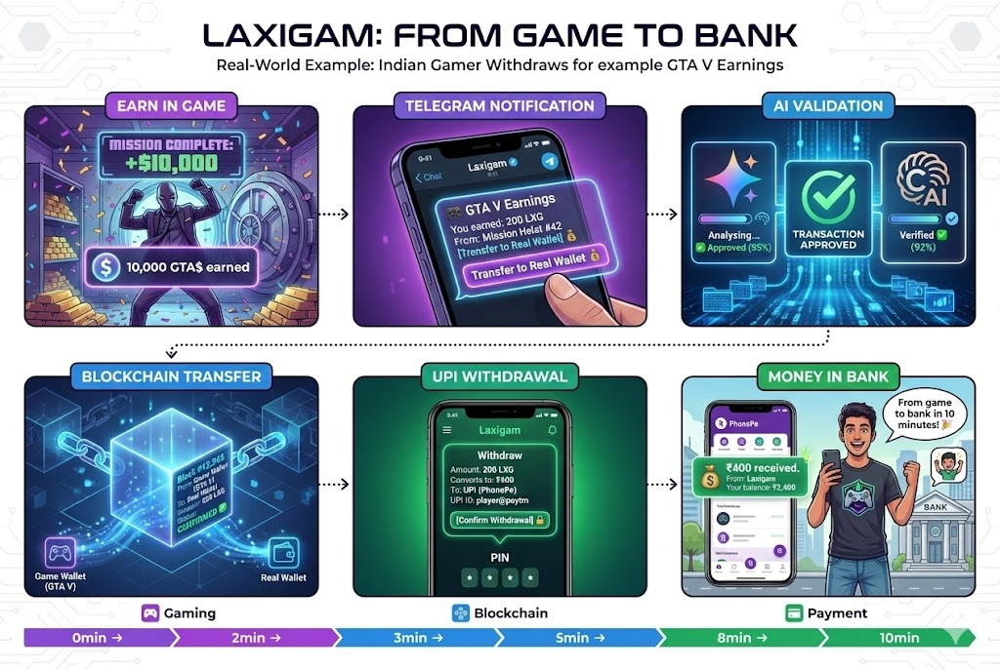
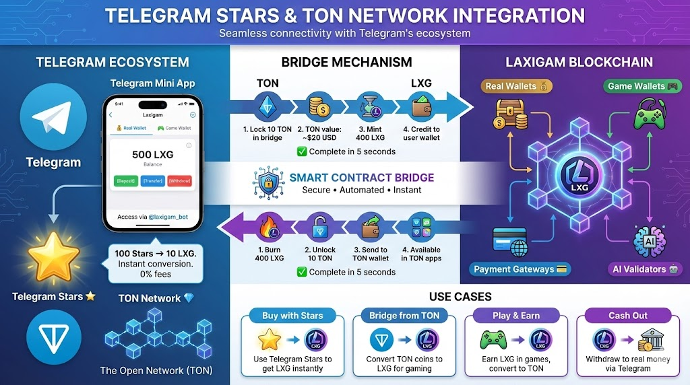
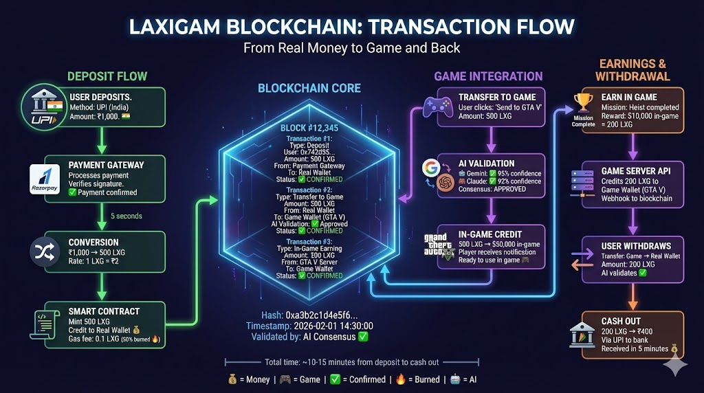
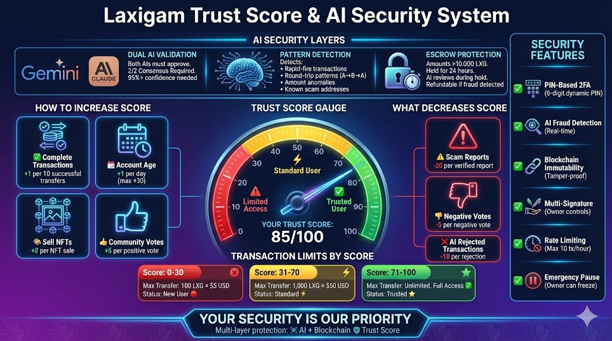
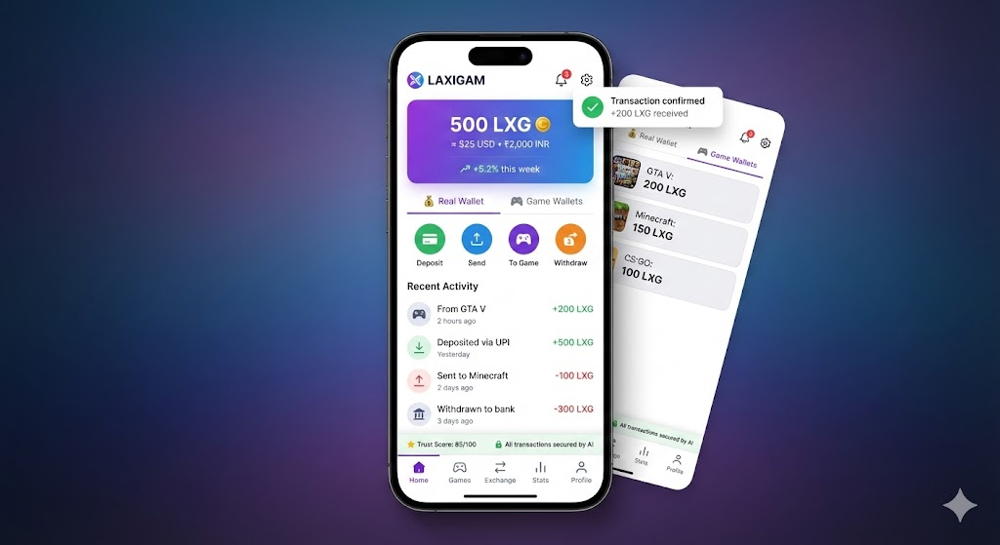

# Laxigam Blockchain 🚀

**The Gaming-to-Bank Bridge for BRICS+ | LXG Cryptocurrency**

[](https://soliditylang.org/)
[](https://polygon.technology/)
[](./LICENSE)
[](.)
[](.)

> 🎮 **"We turn your game earnings into real money you can spend today."**

---

## 📖 Table of Contents

1. [What is Laxigam?](#-what-is-laxigam)
2. [Vision & Philosophy](#-vision--philosophy)
3. [Key Features](#key-features)
4. [Quick Start Guide](#-quick-start-copy-paste-setup)
5. [Architecture](#️-architecture)
6. [The Mediator App](#-the-mediator-app)
7. [Token Economics](#-token-economics)
8. [Supported Payment Methods](#-supported-payment-methods-by-country)
9. [Telegram & TON Integration](#-telegram-integration)
10. [Complete Flow: Game to Bank](#-game-to-blockchain-to-bank-complete-flow)
11. [For Game Developers](#-for-game-developers)
12. [Security Features](#-security-features)
13. [Fee Structure](#-fee-structure)
14. [API Reference](#-api-reference)
15. [Project Structure](#-project-structure)
16. [Deployment](#-deployment)
17. [Project Gallery](#-project-gallery)
18. [Contributing](#-contributing)
19. [Support & Links](#-support-the-project)

---

## 🌟 What is Laxigam?

Laxigam is a **Mediator Protocol** that bridges gaming economies with real-world payment systems. Players earn LXG tokens in games and withdraw to their local payment methods (UPI, PIX, QIWI, Alipay) in seconds.

```
🎮 Game Earnings → 🪙 LXG Token → 💵 Real Money (UPI/PIX/QIWI/Alipay)
```

### Key Features

| Feature | Description |
|---------|-------------|
| 🌍 **BRICS Payments** | Native support for UPI (India), PIX (Brazil), QIWI (Russia), Alipay (China) |
| 🤖 **AI Fraud Detection** | Dual-AI consensus (Gemini + Claude) validates every transaction |
| ⭐ **Telegram Integration** | Telegram Stars & TON network support |
| 🔐 **Trust Score System** | Community-driven reputation prevents fraud |
| 💎 **Deflationary Token** | 50% of fees are burned, reducing supply over time |

---

## 💡 Vision & Philosophy

In the current digital age, billions of dollars are trapped inside gaming ecosystems. A player in Brazil might be a millionaire in a MMORPG, but struggle to buy lunch in the real world. **Laxigam bridges this gap.**

### The Problem
- **Locked Value:** In-game currency is usually stuck in the game.
- **Banking Access:** Many gamers in BRICS nations lack easy access to dollars or international wires.
- **Complexity:** Crypto exchanges are too complex for the average teenager playing a shooter game.

### The Solution: The "Mediator" Model
Laxigam isn't just a token; it's a **Mediator Protocol**.
1. **Any Game** can plug into Laxigam.
2. **Any Player** can withdraw earnings to their local payment method (UPI, PIX, Alipay).
3. **Real Value** flows from the virtual world to the physical world instantly.

> *"We are building the plumbing that turns digital effort into physical sustenance."*

---

## 📦 Quick Start (Copy-Paste Setup)

### Prerequisites

```bash
# Required
node -v    # v18+
npm -v     # v9+
python --version  # 3.9+
```

### 1. Clone & Install

```bash
# Clone the repository
git clone https://github.com/NIGAM-RATHOD/Laxigam_Blockchain.git
cd Laxigam_Blockchain

# Install smart contract dependencies
npm install

# Install backend dependencies
cd backend
pip install -r requirements.txt
cd ..

# Install frontend dependencies
cd frontend
npm install
cd ..
```

### 2. Configure Environment

```bash
# Copy example env file
cp .env.example .env
```

Edit `.env` with your keys:

```env
# Required for deployment
DEPLOYER_PRIVATE_KEY=your_wallet_private_key
POLYGON_RPC_URL=https://polygon-rpc.com
POLYGONSCAN_API_KEY=your_polygonscan_key

# AI Services (for fraud detection)
GEMINI_API_KEY=your_gemini_key
ANTHROPIC_API_KEY=your_claude_key

# Payment Gateways
RAZORPAY_KEY_ID=your_razorpay_key
RAZORPAY_SECRET=your_razorpay_secret
TELEGRAM_BOT_TOKEN=your_bot_token
```

### 3. Compile & Test Contracts

```bash
# Compile all contracts
npx hardhat compile

# Run tests
npx hardhat test

# Check gas costs
npx hardhat test --gas-reporter
```

### 4. Deploy Contracts

```bash
# Deploy to local network (for testing)
npx hardhat node  # Terminal 1
npx hardhat run scripts/deploy.js --network localhost  # Terminal 2

# Deploy to Polygon Mainnet
npx hardhat run scripts/deploy.js --network polygon
```

### 5. Start Backend

```bash
cd backend
python main.py
# API available at http://localhost:8000
# Docs at http://localhost:8000/docs
```

### 6. Start Frontend

```bash
cd frontend
npm run dev
# App available at http://localhost:5173
```

---

## 🏗️ Architecture



---

## 📱 The Mediator App

The **Mediator App** is the core user interface for converting between fiat and LXG.

### 🎮 For Gamers
- **One-Tap Withdraw:** Convert LXG directly to UPI/PIX. No exchanges, no P2P scams.
- **Merger Tech:** Even if you earn Telegram Stars or TON, the Mediator App can swap them for LXG and cash them out.

### 💼 For Real-World Usage
- **The Student in Mumbai:** Plays for 2 hours, earns 50 LXG, withdraws ₹100 via UPI to pay for a canteen meal.
- **The Artist in Moscow:** Sells game skins for LXG, withdraws RUB via QIWI to pay rent.
- **The Streamer in Sao Paulo:** Receives LXG donations, withdraws BRL via PIX instantly.

### How It Works

**Deposit (Buy LXG):**
1. User selects payment method (UPI/PIX/QIWI/Alipay)
2. Enters fiat amount
3. Scans QR / completes payment
4. LXG sent to wallet automatically

**Withdraw (Sell LXG):**
1. User enters LXG amount
2. Provides payout destination (UPI ID, PIX key, etc.)
3. Signs blockchain transaction
4. Fiat sent within 24 hours

### Code Location

| Component | Path |
|-----------|------|
| Smart Contract | `contracts/MediatorVault.sol` |
| Backend API | `backend/mediator_service.py` |
| Frontend UI | `frontend/src/pages/Mediator.jsx` |
| Spec Document | `docs/MEDIATOR_APP_SPEC.md` |

---

## 🪙 Token Economics

| Property | Value |
|----------|-------|
| **Name** | Laxigam |
| **Symbol** | LXG |
| **Standard** | ERC-20 |
| **Total Supply** | 1,000,000,000 |
| **Network** | Polygon (MATIC) |
| **Burn Rate** | 50% of transaction fees |
| **Validator Pool** | 50% of transaction fees |

---

## 🌍 Supported Payment Methods by Country

### 🇮🇳 India - UPI (Unified Payments Interface)

**What is UPI?**
UPI is India's instant payment system. Users can send money using just a phone number or UPI ID.

**Supported Apps:** PhonePe, Google Pay, Paytm, BHIM, Amazon Pay

**How It Works in Laxigam:**

```
Step 1: User Opens Laxigam App → Clicks "Deposit"
Step 2: Selects "UPI" Payment Method → Enters amount: ₹1,000
Step 3: System Converts to LXG → Shows: ₹1,000 = 500 LXG (rate: 1 LXG = ₹2)
Step 4: QR Code Appears → User scans with PhonePe/GPay
Step 5: Confirms Payment → Enters UPI PIN
Step 6: Within 5 seconds → ₹1,000 received, 500 LXG credited
```

<details>
<summary><b>📝 Technical Implementation (Click to expand)</b></summary>

```python
# Using Razorpay (supports UPI)
from razorpay import Client

def create_upi_deposit(user_id, amount_inr):
    client = Client(auth=(RAZORPAY_KEY, RAZORPAY_SECRET))
    lxg_amount = amount_inr / get_lxg_inr_rate()
    
    order = client.order.create({
        'amount': amount_inr * 100,  # paise
        'currency': 'INR',
        'payment_capture': 1,
        'notes': {'user_id': user_id, 'lxg_amount': lxg_amount}
    })
    
    payment_link = f"upi://pay?pa=laxigam@paytm&pn=Laxigam&am={amount_inr}&cu=INR"
    return {'order_id': order['id'], 'payment_link': payment_link, 'lxg_amount': lxg_amount}
```
</details>

---

### 🇧🇷 Brazil - PIX (Instant Payment System)

**What is PIX?**
PIX is Brazil's instant payment system, launched by Central Bank of Brazil. Transfers happen in less than 10 seconds, 24/7.

**How It Works:**
```
Step 1: User Clicks "Deposit" → Selects "PIX"
Step 2: Enters Amount → R$ 100 → Converts to: 200 LXG
Step 3: PIX QR Code Generated
Step 4: User Opens Bank App → Scans QR → Confirms
Step 5: Within 10 seconds → 200 LXG credited
```

<details>
<summary><b>📝 Technical Implementation (Click to expand)</b></summary>

```python
import mercadopago

def create_pix_deposit(user_id, amount_brl):
    sdk = mercadopago.SDK(MERCADOPAGO_ACCESS_TOKEN)
    lxg_amount = amount_brl / get_lxg_brl_rate()
    
    payment_data = {
        "transaction_amount": amount_brl,
        "description": f"Laxigam LXG Purchase - {lxg_amount} tokens",
        "payment_method_id": "pix",
        "payer": {"email": get_user_email(user_id)},
        "notification_url": "https://api.laxigam.io/webhook/mercadopago"
    }
    
    result = sdk.payment().create(payment_data)
    return result["response"]
```
</details>

---

### 🇷🇺 Russia - QIWI Wallet

**What is QIWI?**
QIWI is a popular e-wallet in Russia. Users can pay via phone number, at QIWI kiosks, or online.

**How It Works:**
```
Step 1: User Selects "QIWI Wallet" → Enters amount: ₽500 → 111 LXG
Step 2: Enters QIWI Phone Number → +79991234567
Step 3: Payment Request Sent → User confirms in QIWI app
Step 4: ₽500 transferred → 111 LXG credited
```

---

### 🇨🇳 China - Alipay & WeChat Pay

**What are Alipay & WeChat Pay?**
The two dominant payment systems in China. Nearly everyone uses them for everything.

**How It Works:**
```
Step 1: User Selects Alipay/WeChat Pay → Enters: ¥100 → 222 LXG
Step 2: QR Code Appears → Scans with app
Step 3: Confirms with Face ID/fingerprint
Step 4: ¥100 sent → 222 LXG received
```

---

### 💳 Global - Credit/Debit Cards

Using **Stripe** for Visa, Mastercard, Amex worldwide.

---

## ⭐ Telegram Integration

### Telegram Stars (In-App Currency)

**What are Telegram Stars?**
Telegram's own virtual currency. Users can buy Stars with real money and use them in Telegram apps.

**Conversion Rate:** 10 Stars = 1 LXG

```
Step 1: User Opens Laxigam in Telegram → Clicks "Deposit with Stars"
Step 2: Selects 100 Stars → Converts to: 10 LXG
Step 3: Telegram Payment Dialog → Confirms
Step 4: Stars deducted → 10 LXG credited instantly
```

<details>
<summary><b>📝 Technical Implementation (Click to expand)</b></summary>

```python
from telegram import LabeledPrice

async def create_stars_invoice(user_id, stars_amount):
    lxg_amount = stars_amount / 10  # 10 Stars = 1 LXG
    prices = [LabeledPrice(label="LXG Tokens", amount=stars_amount)]
    
    await bot.send_invoice(
        chat_id=user_id,
        title="Buy LXG Tokens",
        description=f"Purchase {lxg_amount} LXG using {stars_amount} Telegram Stars",
        payload=f"lxg_purchase_{user_id}_{lxg_amount}",
        provider_token="",  # Empty for Stars
        currency="XTR",     # Telegram Stars currency code
        prices=prices
    )
```
</details>

---

### 💎 TON Network Integration

**What is TON?**
The Open Network (TON) is a blockchain created by Telegram with fast transactions and low fees.

**TON ↔ LXG Bridge:**
```
┌─────────────────────────────────────────┐
│         TON BLOCKCHAIN                  │
│  User has: 10 TON (worth ~$20 USD)     │
└──────────────┬──────────────────────────┘
               ↓ User clicks "Convert TON to LXG"
┌─────────────────────────────────────────┐
│         BRIDGE CONTRACT                 │
│  1. Lock 10 TON in TON bridge          │
│  2. Calculate: 10 TON = 400 LXG        │
│  3. Emit bridge event                  │
└──────────────┬──────────────────────────┘
               ↓ Backend listens for event
┌─────────────────────────────────────────┐
│     LAXIGAM BLOCKCHAIN (Polygon)       │
│  1. Verify TON lock transaction        │
│  2. Mint 400 LXG to user's wallet      │
└─────────────────────────────────────────┘
```

---

## 🎮 Game to Blockchain to Bank: Complete Flow

### Example: Player Earns in GTA V, Withdraws to UPI (India)

```
STEP 1: PLAYER EARNS IN-GAME
┌─────────────────────────────┐
│      GTA V Game Server      │
│ Player completes mission    │
│ Earns: $10,000 in-game     │
└──────────────┬──────────────┘
               ↓ Game calls Laxigam API
┌─────────────────────────────┐
│    LAXIGAM BACKEND          │
│ Convert: $10,000 = 200 LXG  │
│ Call smart contract         │
└──────────────┬──────────────┘
               ↓
┌─────────────────────────────┐
│   BLOCKCHAIN (GameBridge)   │
│ Credits 200 LXG to game     │
│ wallet                      │
└──────────────┬──────────────┘
               ↓
┌─────────────────────────────┐
│   TELEGRAM NOTIFICATION     │
│ "🎮 GTA V: +200 LXG"       │
│ [Withdraw to Real Wallet]   │
└──────────────┬──────────────┘
               ↓

STEP 2: AI VALIDATION
┌─────────────────────────────┐
│     AI VALIDATION           │
│ ├─ Google Gemini: ✅ 95%   │
│ └─ Anthropic Claude: ✅ 92%│
│ Consensus: APPROVED ✅      │
└──────────────┬──────────────┘
               ↓

STEP 3: CASH OUT TO UPI
┌─────────────────────────────┐
│   USER INITIATES WITHDRAWAL │
│ Amount: 200 LXG → ₹400      │
│ UPI ID: player@paytm        │
└──────────────┬──────────────┘
               ↓
┌─────────────────────────────┐
│   USER'S BANK ACCOUNT       │
│ ✅ ₹400 received!           │
└─────────────────────────────┘

🎉 COMPLETE! Total time: ~10 minutes
```

---

## 🎮 For Game Developers

Integrate your game with Laxigam to let players deposit real money and withdraw game earnings.

See the [Game Integration Guide](./docs/GAME_INTEGRATION.md) for full details.

**Quick Example:**

```javascript
// Credit player after mission completion
const response = await fetch('https://api.laxigam.io/api/game/credit', {
  method: 'POST',
  headers: { 'X-API-Key': 'YOUR_GAME_API_KEY' },
  body: JSON.stringify({
    player_wallet: '0x...',
    game: 'YOUR_GAME_NAME',
    amount_ingame: 1000,
    reason: 'Mission completed'
  })
});
```

---

## 🔐 Security Features

| Feature | Description |
|---------|-------------|
| **Two-Factor Authentication** | PIN sent via Telegram for every transaction |
| **AI Fraud Detection** | Dual AI validation (Gemini + Claude) |
| **Trust Score System** | Limits based on user reputation |
| **Escrow System** | Transfers >10,000 LXG held for 24 hours |
| **Audited Contracts** | Using battle-tested OpenZeppelin libraries |
| **Pausable** | Owner can pause in emergencies |

---

## 📊 Fee Structure

| Transaction Type | Fee | Notes |
|-----------------|-----|-------|
| Deposit (UPI/PIX/QIWI/Alipay) | 0% | **Free!** |
| Deposit (Credit Card) | 2.9% + $0.30 | Standard card fees |
| Deposit (Telegram Stars) | 0% | **Free!** |
| Deposit (TON) | 0.5% | Bridge fee |
| Transfer (Real → Game) | 0.1 LXG | 50% burned |
| Transfer (Game → Real) | 0.1 LXG | 50% burned |
| Withdraw (UPI) | 0% | **Free for Indian users!** |
| Withdraw (PIX) | 0% | **Free for Brazilian users!** |
| Withdraw (QIWI) | 1% | Min 10 RUB |
| Withdraw (Alipay) | 0.5% | Min 1 CNY |
| Withdraw (Card/Bank) | 2% | Min $1 |

---

## 🌐 Supported Countries Summary

| Country | Payment Methods | Deposit Time | Withdrawal Time |
|---------|----------------|--------------|-----------------|
| 🇮🇳 India | UPI (PhonePe, GPay, Paytm) | <30 sec | <5 min |
| 🇧🇷 Brazil | PIX | <10 sec | <10 min |
| 🇷🇺 Russia | QIWI, Yandex Money | <1 min | <30 min |
| 🇨🇳 China | Alipay, WeChat Pay | <30 sec | <1 hour |
| 🌍 Global | Visa, Mastercard, Amex | <5 min | 1-3 days |
| 📱 Telegram | Stars, TON | Instant | Instant |

---

## 📄 API Reference

Full API documentation available at `/docs` when running the backend.

**Core Endpoints:**

| Method | Endpoint | Description |
|--------|----------|-------------|
| POST | `/api/mediator/deposit/initiate` | Start a deposit |
| POST | `/api/mediator/withdraw/initiate` | Start a withdrawal |
| GET | `/api/mediator/quote` | Get conversion quote |
| GET | `/api/mediator/rates` | Current exchange rates |
| POST | `/api/ai/validate` | Validate transaction |
| POST | `/api/pin/generate` | Generate security PIN |

See [API Documentation](./docs/API.md) for full details.

---

## 📂 Project Structure

```
Laxigam_Blockchain/
├── contracts/              # Solidity smart contracts
│   ├── LXGToken.sol        # Main ERC-20 token
│   ├── MediatorVault.sol   # Fiat<->LXG conversion vault
│   ├── GameBridge.sol      # Game wallet system
│   ├── AIValidator.sol     # AI validation oracle
│   ├── TrustScore.sol      # Reputation system
│   ├── Governance.sol      # DAO governance
│   └── NFTMarketplace.sol  # Game item marketplace
│
├── backend/                # Python FastAPI server
│   ├── main.py             # Main API routes
│   ├── mediator_service.py # Mediator endpoints
│   ├── signer.py           # Blockchain signing
│   └── payments/           # Payment gateway handlers
│       ├── india_upi.py
│       ├── brazil_pix.py
│       ├── russia_qiwi.py
│       ├── china_alipay.py
│       ├── telegram_stars.py
│       └── ton_network.py
│
├── frontend/               # React + Vite frontend
│   └── src/pages/Mediator.jsx
│
├── scripts/deploy.js       # Deployment scripts
├── test/                   # Contract tests
├── docs/                   # Documentation
├── hardhat.config.js       # Hardhat configuration
└── docker-compose.yml      # Docker setup
```

---

## 🚀 Deployment

See [Deployment Guide](./docs/DEPLOYMENT.md) for production deployment instructions including:
- Server setup
- Docker deployment
- Nginx configuration
- SSL certificates
- Payment gateway setup
- Monitoring

---

## 📸 Project Gallery

| Preview | Description |
|---------|-------------|
|  | System Architecture |
|  | Global Payment Coverage |
|  | Game to Bank Flow |
|  | Telegram & TON Integration |
|  | Transaction Journey |
|  | AI Security System |
|  | Mobile App Interface |

---

## 🤝 Contributing

1. Fork the repository
2. Create a feature branch: `git checkout -b feature/amazing-feature`
3. Commit changes: `git commit -m 'Add amazing feature'`
4. Push: `git push origin feature/amazing-feature`
5. Open a Pull Request

---

## 📜 License

MIT License - See [LICENSE](./LICENSE) file

**Attribution Required:** If you use Laxigam blockchain, please credit "Powered by Laxigam"

---

## 🚀 Project Evolution & Meme Coin Launch

To keep the project accessible, we have transitioned the experimental phase of Laxigam (LXG) into a **Meme Coin** within the Telegram ecosystem via the **Blum** app.

### 🪙 Token Details
- **Token ID:** `EQDnEqaFaq5-yBqOznT4hXoX7PvM11ib8aUdLK-HRbxMeXBd`
- **Join the Community:** [Launch Laxigam on Blum](https://t.me/blum/app?startapp=memepadjetton_LXG_sduHT-ref_R1rJWgg92E)

---

## ☕ Support the Project

If you find this project useful, consider supporting the development!

<a href="https://buymeacoffee.com/nigamrathoq" target="_blank"></a>

<a href="https://www.paypal.me/laxigam007" target="_blank"></a>

---

## 🔗 Links

- **Documentation**: [docs.laxigam.io](https://docs.laxigam.io)
- **Discord**: [discord.gg/laxigam](https://discord.gg/laxigam)
- **Telegram**: [@LaxigamBot](https://t.me/LaxigamBot)
- **Twitter**: [@Laxigam](https://twitter.com/Laxigam)

---

<p align="center">
  <b>Built with ❤️ by Nigam Rathod & the Laxigam Team</b><br>
  <i>Connecting the world's payment systems with gaming economies</i> 🌍🎮💰
</p>

---

*Last Updated: February 3, 2026 | Version: 1.0.0 | Status: Production Ready*
