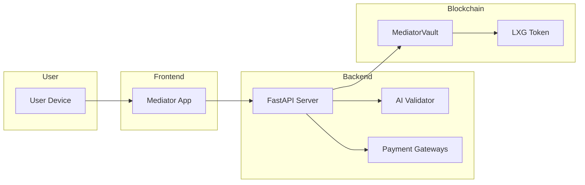
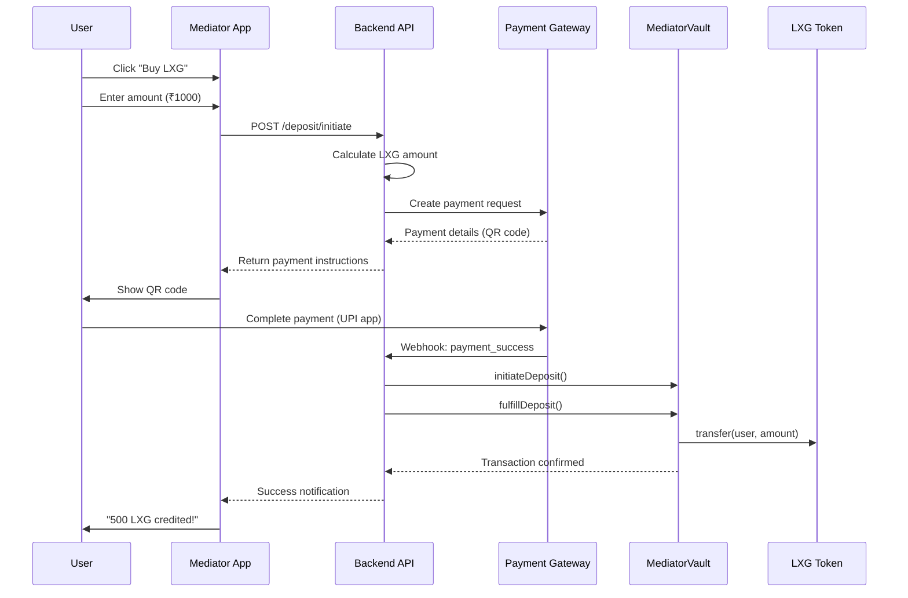
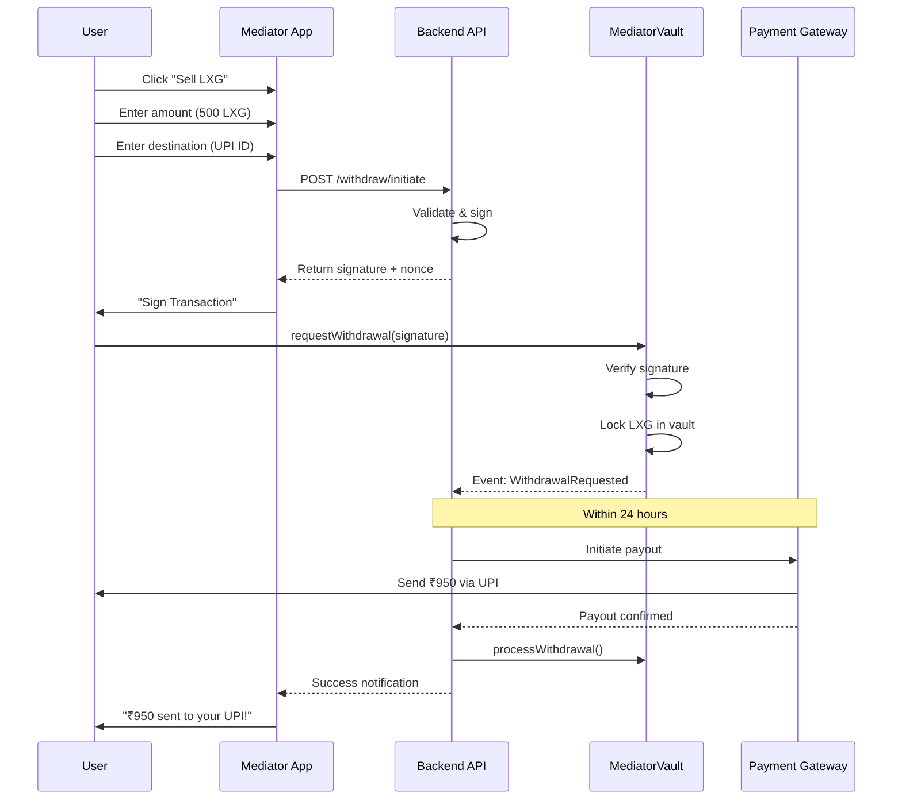

# Laxigam Mediator App Specification

## 1. Overview

The **Laxigam Mediator App** is the central bridge connecting users to the LXG ecosystem. It handles all fiat-to-crypto and crypto-to-fiat conversions.

| Platform | Technology |
|----------|-----------|
| **Mobile** | React Native (Android focus) |
| **Web** | React + Vite |
| **Smart Contract** | Solidity (MediatorVault.sol) |
| **Backend** | Python FastAPI |

---

## 2. Core Philosophy

| Principle | Implementation |
|-----------|----------------|
| **Trust** | Oracle-verified transactions, escrow for large amounts |
| **Speed** | Instant deposits via local payment rails |
| **Simplicity** | Users see "Buy" and "Sell", not blockchain complexity |

---

## 3. System Architecture



---

## 4. Deposit Flow (Fiat → LXG)

### Sequence Diagram



### API Endpoint

```http
POST /api/mediator/deposit/initiate
Content-Type: application/json

{
  "wallet_address": "0x...",
  "payment_method": "UPI",
  "amount_fiat": 1000,
  "currency": "INR"
}
```

**Response:**

```json
{
  "success": true,
  "payment_id": "abc123...",
  "lxg_amount": 500.0,
  "payment_details": {
    "qr_code": "upi://pay?pa=laxigam@upi&pn=Laxigam&am=1000",
    "upi_id": "laxigam@upi"
  },
  "expires_at": "2024-01-15T12:30:00Z"
}
```

---

## 5. Withdrawal Flow (LXG → Fiat)

### Sequence Diagram



### API Endpoint

```http
POST /api/mediator/withdraw/initiate
Content-Type: application/json

{
  "wallet_address": "0x...",
  "amount_lxg": 500,
  "payment_method": "UPI",
  "destination": "user@upi",
  "currency": "INR"
}
```

**Response:**

```json
{
  "success": true,
  "request_id": "xyz789...",
  "output": {
    "amount": 950.0,
    "currency": "INR",
    "destination": "user@upi"
  },
  "blockchain_data": {
    "signature": "0x...",
    "nonce": 1699999999,
    "contract_method": "requestWithdrawal"
  },
  "estimated_payout_hours": 24
}
```

---

## 6. Smart Contract Interface

### MediatorVault.sol

```solidity
// Deposit Flow (called by oracle backend)
function initiateDeposit(
    bytes32 paymentId,
    address user,
    uint256 amountLXG,
    uint256 amountFiat,
    string calldata currency,
    string calldata paymentMethod
) external onlyOracle;

function fulfillDeposit(bytes32 paymentId) external onlyOracle;

// Withdrawal Flow (called by user with off-chain signature)
function requestWithdrawal(
    uint256 amountLXG,
    string calldata destination,
    string calldata currency,
    uint256 amountFiat,
    uint256 nonce,
    bytes calldata signature
) external;

function processWithdrawal(bytes32 requestId) external onlyOracle;
```

---

## 7. Fees

| Operation | Fee | Recipient |
|-----------|-----|-----------|
| Deposit | 0.5% | Treasury |
| Withdrawal | 1.0% | Treasury |

---

## 8. Security

| Feature | Description |
|---------|-------------|
| **Signature Verification** | All operations require oracle signature |
| **Daily Limits** | 10,000 LXG per user per day |
| **Minimum Amounts** | Deposit: 10 LXG, Withdrawal: 50 LXG |
| **Pausable** | Owner can pause in emergencies |
| **Escrow** | Large amounts (>10k LXG) held 24h |

---

## 9. Future Roadmap

- [ ] Multi-signature admin for vault operations
- [ ] Upgradeable contract proxy
- [ ] Additional payment methods (SEPA, ACH)
- [ ] Mobile app (React Native)
- [ ] White-label SDK for game developers
